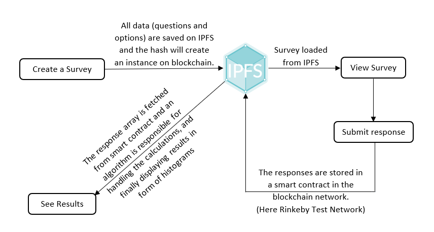

# Irrevocable-Voting-Platform

This is a decentralized app (DApp) which provides a platform for public and private (or authorized) surveys.\
A public survey is open-to-all, anyone can submit responses to these surveys.\
A private or authorized survey allows limited participation, where the creator of the survey has to give permission using email IDs (linked to their Metamask account addresses) to take part in the survey. The users get an email notification whenever they are added as participants to a private survey.\
Each survey has a specific date and time till which it accepts responses.\
During the survey as well as after it ends, one can view the current analysis of the survey responses, which has been presented in the form of total responses and histograms to depict the results in form of graphs.

## How to get started ?
1. Download Metamask extension from chrome web store.([https://chrome.google.com/webstore/detail/metamask/nkbihfbeogaeaoehlefnkodbefgpgknn?hl=en](https://chrome.google.com/webstore/detail/metamask/nkbihfbeogaeaoehlefnkodbefgpgknn?hl=en))
2. Create an account and get test ethers.
3. Visit the deployed link to view the project [Irrevocable-Voting-Platform](https://irrevocable-voting-platform.vercel.app/).

## How it works ?

## Tech Stack used
1. HTML
2. CSS
3. React JS
4. ethers JS
5. Typescript
6. email JS
7. Solidity
8. Database: MongoDB
9. Blockchain network: Infura, Rinkeby Test Network, IPFS
